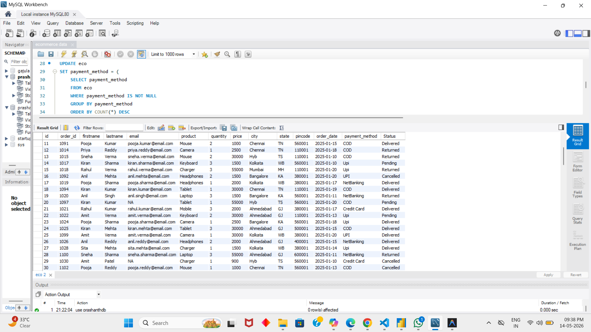
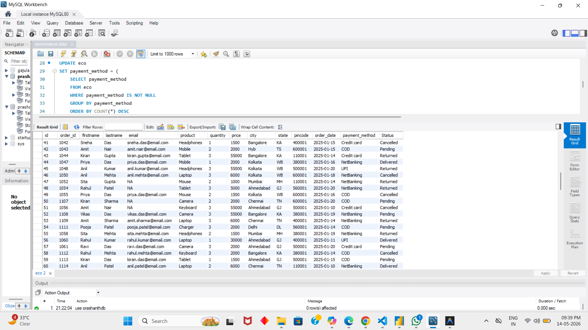

# 🛒 E-Commerce Data Cleaning — SQL Project

A real-world **data cleaning project** using MySQL, applied on raw e-commerce customer and order data. This project demonstrates how to handle messy, inconsistent, and incomplete data to make it analysis-ready.

---

## 📂 Repository Structure

```
ecommerce-data-cleaning-sql/
│
├── data/
│   └── raw_data.csv              ← Raw/dirty data (before cleaning)
│
├── images/
│   ├── cleaned_data_1.png        ← Cleaned data screenshots
│   ├── cleaned_data_2.png
│   ├── cleaned_data_3.png
│   └── cleaned_data_4.png
│
├── ecommerce_data.sql            ← SQL data cleaning script
└── README.md
```

---

## 📁 Dataset Overview

**Table:** `eco` (inside `prashanthdb`)

| Column | Description |
|---|---|
| `id` | Auto-generated primary key |
| `order_id` | Unique order identifier |
| `firstname` | Customer first name |
| `lastname` | Customer last name |
| `email` | Customer email address |
| `product` | Ordered product name |
| `quantity` | Number of units ordered |
| `price` | Product price (INR) |
| `city` | Customer city |
| `state` | Customer state code (e.g., TS, MH) |
| `pincode` | Area pincode |
| `payment_method` | Payment used (UPI, Credit Card, etc.) |
| `order_date` | Date of order (YYYY-MM-DD) |
| `status` | Order status (Delivered, Pending, etc.) |

---

## 🧹 Data Cleaning Steps

### ✅ Step 1 — Add Primary Key
```sql
ALTER TABLE eco 
ADD COLUMN id INT AUTO_INCREMENT PRIMARY KEY FIRST;
```
> Added a unique `id` column to each row for better tracking.

---

### ✅ Step 2 — Replace 'NA' / Empty Strings with NULL
```sql
UPDATE eco SET email = NULL WHERE email = 'NA' OR email = '';
UPDATE eco SET firstname = NULL WHERE firstname = 'NA' OR firstname = '';
UPDATE eco SET lastname = NULL WHERE lastname = 'NA' OR lastname = '';
UPDATE eco SET product = NULL WHERE product = 'NA' OR product = '';
UPDATE eco SET quantity = NULL WHERE quantity = 'NA' OR quantity = '';
UPDATE eco SET price = NULL WHERE price = 'NA' OR price = '';
UPDATE eco SET city = NULL WHERE city = 'NA' OR city = '';
UPDATE eco SET state = NULL WHERE state = 'NA' OR state = '';
UPDATE eco SET pincode = NULL WHERE pincode = 'NA' OR pincode = '';
UPDATE eco SET payment_method = NULL WHERE payment_method = 'NA' OR payment_method = '';
UPDATE eco SET status = NULL WHERE status = 'NA' OR status = '';
```
> Converted all placeholder 'NA' and empty strings to proper SQL `NULL` values.

---

### ✅ Step 3 — Fill Missing Quantity
```sql
UPDATE eco SET quantity = 1 WHERE quantity IS NULL;
```
> Defaulted missing quantities to `1` (minimum order assumption).

---

### ✅ Step 4 — Standardize City Names
```sql
UPDATE eco SET city = 'Hyderabad' WHERE city IN ('Hyb', 'HYD');
```
> Fixed inconsistent city name spellings.

---

### ✅ Step 5 — Standardize Payment Methods
```sql
UPDATE eco SET payment_method = 'UPI'         WHERE payment_method IN ('Upi', 'upi');
UPDATE eco SET payment_method = 'Credit Card' WHERE payment_method IN ('Credit card', 'credit card');
UPDATE eco SET payment_method = 'Net Banking' WHERE payment_method = 'NetBanking';
```
> Normalized all payment method values to consistent casing and naming.

---

### ✅ Step 6 — Impute NULL Payment Method (Mode Imputation)
```sql
UPDATE eco 
SET payment_method = (
    SELECT payment_method
    FROM eco
    WHERE payment_method IS NOT NULL
    GROUP BY payment_method
    ORDER BY COUNT(*) DESC
    LIMIT 1
)
WHERE payment_method IS NULL;
```
> Filled missing payment methods with the **most frequently used** payment method.

---

### ✅ Step 7 — Fix Order Date Format
```sql
UPDATE eco 
SET order_date = STR_TO_DATE(order_date, '%Y-%m-%d');
```
> Converted `order_date` from text to proper MySQL `DATE` format.

---

### ✅ Step 8 — Impute NULL Prices (Mean by Product)
```sql
UPDATE eco 
SET price = (
    SELECT AVG(price)
    FROM eco e2
    WHERE e2.product = eco.product
)
WHERE price IS NULL;

UPDATE eco SET price = ROUND(price, 2);
```
> Replaced missing prices with the **average price of that product**, then rounded to 2 decimal places.

---

### ✅ Step 9 — Derive City from State Code
```sql
UPDATE eco 
SET city = CASE 
    WHEN state = 'DL' THEN 'Delhi'
    WHEN state = 'GJ' THEN 'Ahmedabad'
    WHEN state = 'KA' THEN 'Bangalore'
    WHEN state = 'MH' THEN 'Mumbai'
    WHEN state = 'TN' THEN 'Chennai'
    WHEN state = 'TS' THEN 'Hyderabad'
    WHEN state = 'WB' THEN 'Kolkata'
    ELSE city
END;
```
> Inferred missing city names from the state code column.

---

### ✅ Step 10 — Remove Incomplete Records
```sql
DELETE FROM eco
WHERE product IS NULL OR order_id IS NULL;
```
> Removed rows where critical fields (`product`, `order_id`) were missing.

---

## 📊 Raw Data (Before Cleaning)

> 📄 Full raw dataset: [`data/raw_data.csv`](data/raw_data.csv)

The raw data contains issues like:
- `'NA'` and empty strings instead of proper NULLs
- Inconsistent city names (`Hyb`, `HYD` instead of `Hyderabad`)
- Mixed-case payment methods (`upi`, `Upi`, `UPI`)
- Missing prices, quantities, and order dates
- Incorrect date formats

---

## ✅ Cleaned Data (After Cleaning)

> All screenshots taken from MySQL Workbench after running the cleaning script.







---

## 🛠 Tools Used

| Tool | Purpose |
|------|---------|
| **MySQL Workbench** | Database management & query execution |
| **SQL** | Data cleaning and transformation |
| **GitHub** | Version control & project showcase |

---

## 🔑 Key Concepts Demonstrated

- ✅ Null handling & standardization
- ✅ String normalization (case, spelling)
- ✅ Mode & mean imputation
- ✅ Date format conversion
- ✅ Derived column logic (CASE WHEN)
- ✅ Data deduplication & deletion

---

## 👤 Author

**Prashanth Gajula**  
📧 [GitHub Profile](https://github.com/prashanthgajula08-dot)
